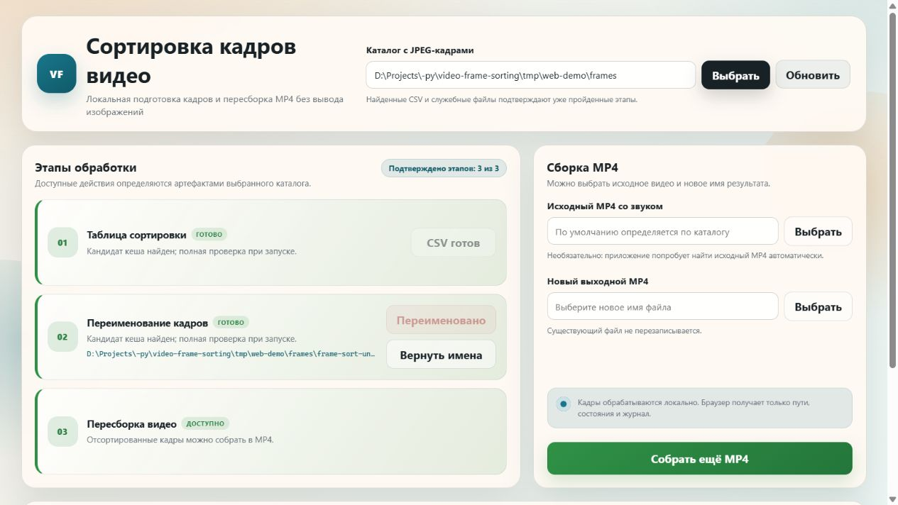

# Video Frame Sorting

Локальный инструмент для восстановления плавного порядка JPEG-кадров без удаления файлов и
изменения их содержимого. Сначала он создаёт CSV соответствия `позиция → исходное имя`, затем
отдельная подтверждённая команда безопасно переименовывает кадры в выбранном каталоге.

Подробные требования и ограничения находятся в [PRD.md](PRD.md).

## Что делает приложение

- находит почти одинаковые кадры, ошибочно повторившиеся через несколько позиций;
- группирует повтор рядом с первым появлением, сохраняя стабильный порядок остальных кадров;
- записывает `frame-sort-plan.csv` в UTF-8 без BOM;
- показывает план переименования без изменения файлов;
- применяет CSV в две фазы только с `--apply` или после подтверждения в веб-интерфейсе;
- сохраняет журнал транзакции и обратный CSV;
- пересобирает новый MP4 по исходной временной шкале и копирует исходный аудиопоток;
- проверяет число аудиокадров и сэмплов, а ошибочные PTS старого AAC исправляет без
  перекодирования звука;
- ведёт ротационный веб-журнал и восстанавливает историю фоновых задач после перезапуска;
- предоставляет CLI и локальный веб-интерфейс без вывода изображений.

Приложение не удаляет дубли, не меняет содержимое JPEG и не перезаписывает исходный MP4.

## Архитектура

Командная строка и веб-интерфейс являются двумя оболочками одного доменного сервиса. Анализ
ничего не меняет в исходных JPEG; применитель CSV изолирован от анализа и запускает отдельную
файловую транзакцию только после явного подтверждения.

```text
<repo-root>/
├── .codex/skills/fix-sonar/
│   ├── SKILL.md          # строгая процедура свежего Sonar-цикла
│   └── scripts/          # coverage, scanner, ожидание CE и проверка Quality Gate
├── frame_sorter/
│   ├── analysis.py       # признаки кадров, поиск возвратов, группировка и создание CSV
│   ├── io_utils.py       # естественная сортировка, проверка каталога и атомарная запись
│   ├── models.py         # неизменяемые модели настроек и результатов
│   ├── renamer.py        # проверка CSV, двухфазное переименование, откат и обратный CSV
│   ├── video.py          # ffprobe, VFR-пересборка MP4, исходное аудио и проверка результата
│   ├── logging_utils.py  # UTF-8-журналы CLI, веб-сервиса и Uvicorn
│   ├── service.py        # единый контракт для CLI и веб-интерфейса
│   ├── cli.py            # команды analyze, preview, apply, recover и rebuild
│   └── web/
│       ├── app.py        # локальный FastAPI, одна фоновая задача и защита Origin
│       ├── job_store.py  # ограниченная история задач и событий в SQLite
│       ├── picker.py     # системные диалоги каталога, исходного и итогового MP4
│       ├── workflow.py   # быстрый кеш этапов по CSV/sidecar без чтения JPEG
│       └── static/       # HTML, CSS и JavaScript без изображений кадров
├── logs/                 # ротационный веб-журнал; создаётся при реальном запуске
├── resources/
│   ├── assets/web.png    # обезличенный пример локального веб-интерфейса
│   └── state/            # SQLite-состояние веб-задач; создаётся при реальном запуске
├── tests/                # модульные, отказные и API-проверки на временных копиях
├── rename_frames.py      # отдельный применитель CSV; просмотр по умолчанию
├── run_web.ps1           # безопасный loopback-запуск веб-интерфейса
├── sonar-project.properties # Python/JS/CSS-анализ и импорт coverage.xml
├── SONAR.md              # переносимый порядок локальной проверки SonarQube
├── PRD.md                # требования, алгоритм, ограничения и критерии приёмки
├── STATUS.md             # датированные результаты проверок и измерений
└── CHANGELOG.md          # история версии
```

Поток данных:

```text
каталог JPEG → естественный исходный порядок → локальный анализ → CSV + metadata JSON
                                                        ↓
                                   предварительная проверка → журнал → rename → проверка
                                                                                ↓
                           исходный MP4 → PTS + аудио → FFmpeg → новый проверенный MP4
```

Служебный JSON связывает CSV со снимком каталога. Поэтому изменённый CSV или изменившийся после
анализа набор файлов нельзя применить незаметно. Журнал записывается до первого переименования и
остаётся достаточным для отката после сбоя.

## Требования

- Windows 10/11;
- Windows PowerShell 5.1 или PowerShell 7 для `run_web.ps1`;
- Python 3.14;
- FFmpeg и ffprobe в `PATH` для пересборки MP4;
- читаемый каталог уникально названных `.jpg`/`.jpeg`; шаблон имени может быть произвольным;
- для веб-интерфейса — доступный `tkinter`, входящий в обычную установку Python для Windows.

## Установка

```powershell
cd <repo-root>
py -3.14 -m venv .venv
.\.venv\Scripts\python.exe -m pip install --upgrade pip
.\.venv\Scripts\python.exe -m pip install -r requirements.txt
```

## Командная строка

Создать CSV в выбранном каталоге:

```powershell
.\.venv\Scripts\python.exe -m frame_sorter analyze --folder "<frames-directory>"
```

Только проверить и показать план переименования:

```powershell
.\.venv\Scripts\python.exe .\rename_frames.py `
  --folder "<frames-directory>" `
  --csv "<frames-directory>\frame-sort-plan.csv"
```

Применить проверенный план:

```powershell
.\.venv\Scripts\python.exe .\rename_frames.py `
  --folder "<frames-directory>" `
  --csv "<frames-directory>\frame-sort-plan.csv" `
  --apply
```

Предварительный просмотр является режимом по умолчанию. Не добавляйте `--apply`, пока путь,
число кадров и CSV не проверены.

Собрать новый MP4 с другим именем после переименования:

```powershell
.\.venv\Scripts\python.exe -m frame_sorter rebuild `
  --folder "<frames-directory>" `
  --original-video "<original.mp4>" `
  --output-video "<new-name.mp4>"
```

Исходный MP4 предоставляет PTS, аудио и метаданные. Аудиопоток обычно копируется напрямую через
FFmpeg, поэтому отдельно извлекать его не нужно. Число кадров должно совпадать, а существующий
выходной файл никогда не перезаписывается. Для старых MP4 с корректным числом AAC-сэмплов, но
ошибочными временными метками пакетов, приложение перенумеровывает только PTS/DTS через
битовый фильтр FFmpeg. Закодированный AAC и число декодируемых сэмплов при этом сохраняются.

## Формат CSV

```csv
position,source_filename
0,VID_20130828_211301_00000.jpg
1,VID_20130828_211301_00001.jpg
2,VID_20130828_211301_00009.jpg
```

`position` начинается с нуля и задаёт итоговый порядок. Для общего числового шаблона она
становится суффиксом; для произвольных имён целевые имена `frame_00000.jpg` и далее хранятся в
служебном JSON. Каждый исходный JPEG должен встречаться ровно один раз.

## Веб-интерфейс

```powershell
.\run_web.ps1
```



После запуска откройте адрес, напечатанный скриптом. Интерфейс работает только через loopback,
не загружает кадры в браузер и не показывает изображения.

- `Создать CSV` — анализирует выбранный каталог;
- `Переименовать` — применяет созданный CSV после подтверждения;
- `Вернуть имена` — появляется после завершённого переименования и применяет связанный с ним
  обратный CSV после отдельного подтверждения;
- `Собрать MP4` — после переименования создаёт новый файл по выбранному пути.

При выборе папки интерфейс сразу ищет `frame-sort-plan.csv + .meta.json` и
`frame-sort-undo-*.csv + .meta.json`. Это быстрая проверка наличия без декодирования и SHA JPEG:
готовая папка сразу открывает `Вернуть имена` и `Собрать MP4`, а папка с планом —
`Переименовать`. Обратный CSV принимается только из последней завершённой транзакции сортировки,
а не как отдельный найденный файл. При нажатии операция повторно проверяет полный снимок и
SHA-256 каждого кадра; повреждённый или чужой кеш завершается безопасной ошибкой. Кнопка
`Обновить` перечитывает артефакты без анализа.

Текущие события передаются через SSE; после обновления страницы интерфейс продолжает задачу с
последнего номера события. Последние 16 задач и до 2000 событий на задачу сохраняются в SQLite.
SQLite хранит историю UI, но не подменяет файловые артефакты. Задача, оборванная перезапуском
процесса, отображается как `interrupted` и не возобновляет файловую операцию автоматически.

Детектор `local-return-v2` сохраняет контекстный фильтр и дополнительно принимает очень близкие
совпадения с характерным лагом 7/14. В журнале отдельно выводятся общее число возвратов, число
строгих совпадений и число кандидатов, отклонённых контекстом.

Веб-сервис, Uvicorn, команды FFmpeg/ffprobe и полные трассировки неожиданных ошибок записываются
в `logs/video-frame-sorting-web.log` как UTF-8. Журнал ротируется при 5 МиБ и хранит три архива.
В браузере остаются последние 250 строк безопасного пользовательского журнала; traceback там не
показывается. Для MP4 журнал содержит число кадров, число аудиопотоков, длительности исходного и
итогового контейнера и видеоряда.

Команды `python -m frame_sorter` записывают стадии и ошибки в
`logs/video-frame-sorting.log`; тот же текст выводится в консоль без traceback для ожидаемых
пользовательских ошибок.

## Настройка веб-запуска

Переносимый пример находится в [.env.example](.env.example):

- `WEB_HOST` — только loopback-адрес, по умолчанию `127.0.0.1`;
- `WEB_PORT` — порт от 1 до 65535, по умолчанию `7863`.
- `WEB_JOB_DB` — абсолютный путь SQLite либо путь относительно корня проекта; по умолчанию
  `resources/state/jobs.sqlite3`.

Локальный `.env` не следует добавлять в систему контроля версий.

## Проверки

```powershell
.\.venv\Scripts\python.exe -m pytest -p no:cacheprovider -q
.\.venv\Scripts\python.exe -m ruff check .
.\.venv\Scripts\python.exe -m compileall -q frame_sorter tests rename_frames.py
node --check frame_sorter\web\static\app.js
```

Полный свежий Sonar-цикл описан в
[SONAR.md](SONAR.md) и локальном навыке
[.codex/skills/fix-sonar/SKILL.md](.codex/skills/fix-sonar/SKILL.md).

Рабочее переименование проверяется только на отдельной копии каталога. Исходные каталоги
фотографий нельзя использовать для отказных тестов.
