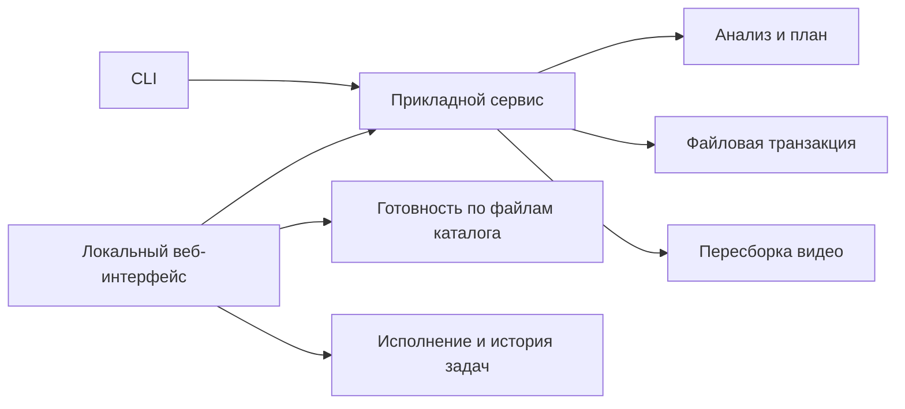

# Архитектура

CLI и локальный веб-интерфейс обращаются к общему прикладному сервису. В нём разделены анализ последовательности,
транзакционное переименование и пересборка видео. Веб-слой управляет локальным исполнением и историей задач.

Схема взаимодействия рабочих входов и компонентов

| Граница                       | Ответственность и нормативный владелец                                                                                                                                                          |
|-------------------------------|-------------------------------------------------------------------------------------------------------------------------------------------------------------------------------------------------|
| Планирование / применение     | Анализ сохраняет исходную последовательность и создаёт план; изменение имён выполняет отдельная транзакция: [ANA](../specs/frame-analysis/spec.md), [REN](../specs/rename-transactions/spec.md) |
| Общая операция / рабочий вход | Сервис владеет предметной операцией, CLI и браузер — её запуском: [WEB-002](../specs/local-web-workflow/spec.md#requirement-web-002-один-сервис)                                                |
| Готовность / история          | Файлы каталога определяют доступность действия, история хранит сведения об исполнении: [WEB-003…006](../specs/local-web-workflow/spec.md)                                                       |
| Результат / оригинал          | Пересборка создаёт и проверяет отдельный MP4: [VID](../specs/video-rebuild/spec.md)                                                                                                             |
| Текущее / планируемое         | Изменение изображений остаётся будущей стадией: [CTX-002](../specs/project-context/spec.md#requirement-ctx-002-текущее-и-планируемое-поведение), [ADR-005](ADR/ADR-005-enhancement-scope.md)    |

Причины крупных решений — в [ADR](ADR/README.md), конкретные условия и связи с проверками — в
[примерах](examples/README.md).
